# Laporan Modul 2: Dasar Pemrograman Java
**Mata Kuliah:** Praktikum Pemrograman Berorientasi Objek   
**Nama:** [Muliadi Tumagger]  
**NIM:** [2024573010062]  
**Kelas:** [TI 2E]

---

# Laporan Praktikum Modul 2 - Dasar Pemrograman Java

---

## 1. Abstrak
Laporan ini berisi rangkuman praktikum dasar pemrograman Java yang meliputi pengenalan variabel dan tipe data, penggunaan input-output dengan Scanner, struktur kontrol percabangan, serta perulangan. Tujuan praktikum ini adalah untuk memahami dasar sintaks Java, menguasai konsep variabel, membaca dan menampilkan data, membuat keputusan dengan percabangan, serta mengimplementasikan logika berulang menggunakan perulangan. Melalui praktikum ini diharapkan mahasiswa mampu mengimplementasikan dasar-dasar pemrograman Java ke dalam program sederhana.

---

## 2. Praktikum

### Praktikum 1 - Variabel dan Tipe Data
#### Dasar Teori
- Tipe data primitif: `int`, `double`, `float`, `char`, `boolean`, dll.
- Tipe data reference: `String`, `Array`, `Object`.
- Variabel adalah wadah untuk menyimpan data.
- Aturan penamaan variabel: tidak boleh diawali angka, case sensitive, tidak boleh pakai keyword Java.

#### Langkah Praktikum
1. Buat package `modul_2` di folder `src`.
2. Buat file baru `VariabelDemo.java`.
3. Ketikkan kode program variabel dan tipe data.

#### Screenshoot Hasil
CODE                    
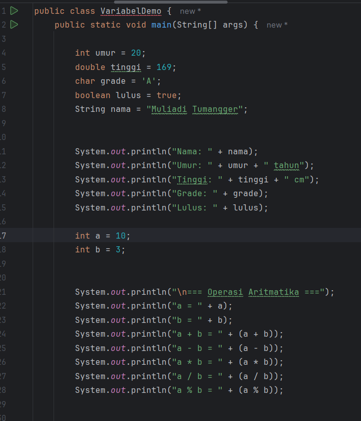
OUTPUT
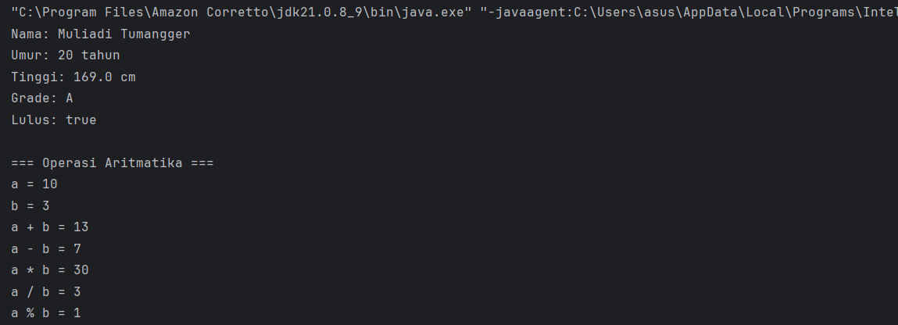

#### Analisa dan Pembahasan
1. Program VariableDemo digunakan untuk mendemonstrasikan:
Deklarasi Variabel
Menampilkan berbagai tipe data (int, double, char, boolean, String).
Operasi Aritmatika
Menunjukkan hasil penjumlahan, pengurangan, perkalian, pembagian, dan modulus dengan tipe int.
Casting Tipe Data
Mengubah double menjadi int dengan explicit casting, di mana angka desimal dibuang (contoh: 9.8 → 9).
Automatic Promotion
Operasi byte + short otomatis dipromosikan ke int agar hasil lebih aman dan konsisten.

### Praktikum 2 - Input, Output, dan Scanner
#### Dasar Teori
- Input di Java menggunakan class `Scanner` dari `java.util`.
- Method penting: `nextInt()`, `nextDouble()`, `nextLine()`, `next()`, `nextBoolean()`.

#### Langkah Praktikum
1. Buat file baru `InputOutputDemo.java`.
2. Import `java.util.Scanner`.
3. Implementasikan program untuk membaca input dan menampilkan output.

#### Screenshoot Hasil
CODE

OUTPUT
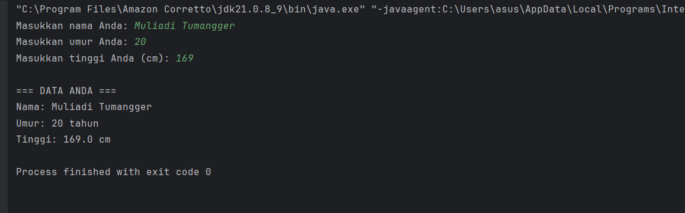

#### Analisa dan Pembahasan
Program berhasil membaca data dari pengguna dan menampilkannya kembali. Class `Scanner` mempermudah interaksi user dengan program.

### Praktikum 3 - Struktur Kontrol: Percabangan
#### Dasar Teori
- `if`, `if-else`, `if-else if-else`, dan `switch` digunakan untuk pengambilan keputusan.
- Berguna untuk mengatur alur logika berdasarkan kondisi tertentu.

#### Langkah Praktikum
1. Buat file `GradeDemo.java` untuk menentukan grade.
2. Buat file `MenuDemo.java` menggunakan `switch`.
3. Buat file `NestedIfDemo.java` untuk menentukan kategori usia.

#### Screenshoot Hasil
Grademo.java
CODE
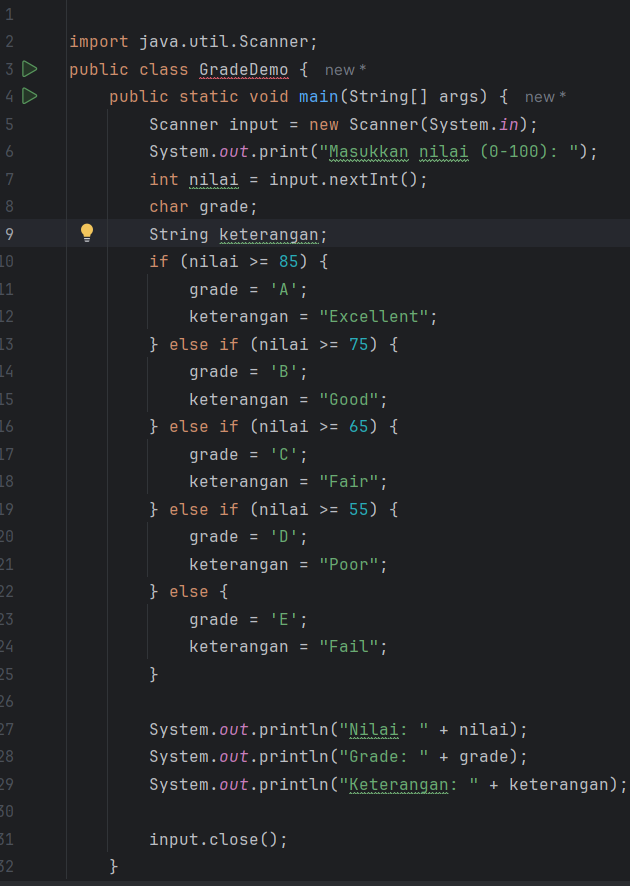
OUTPUT
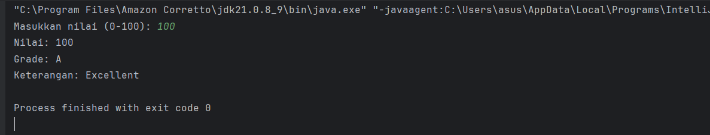
MenuDemo.Java
CODE
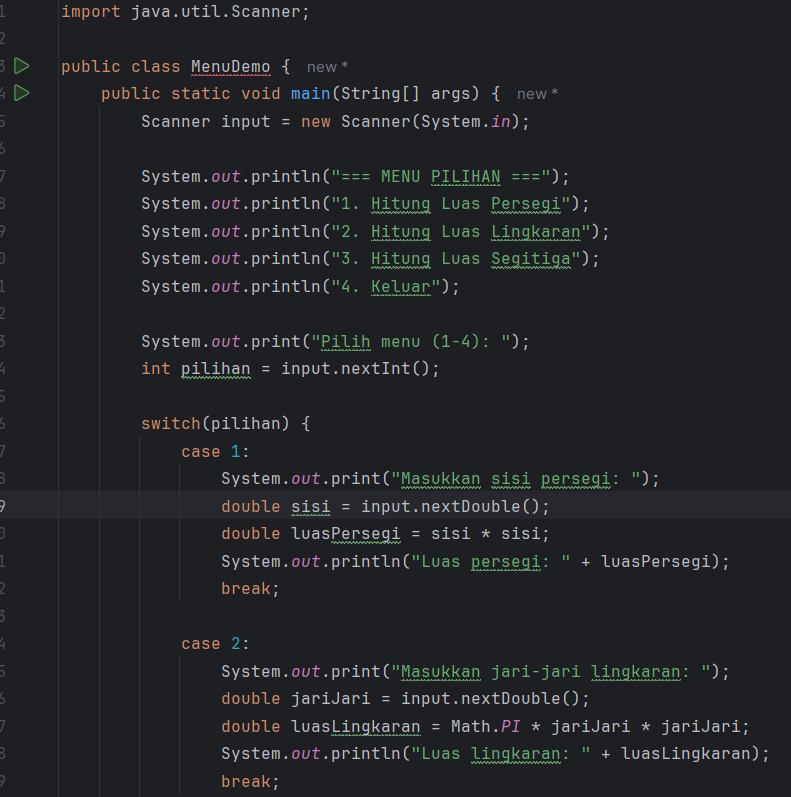
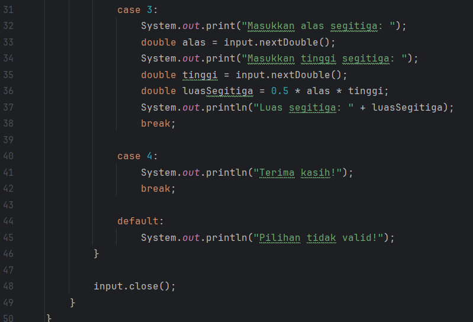
Nestedifdemo.java
CODE
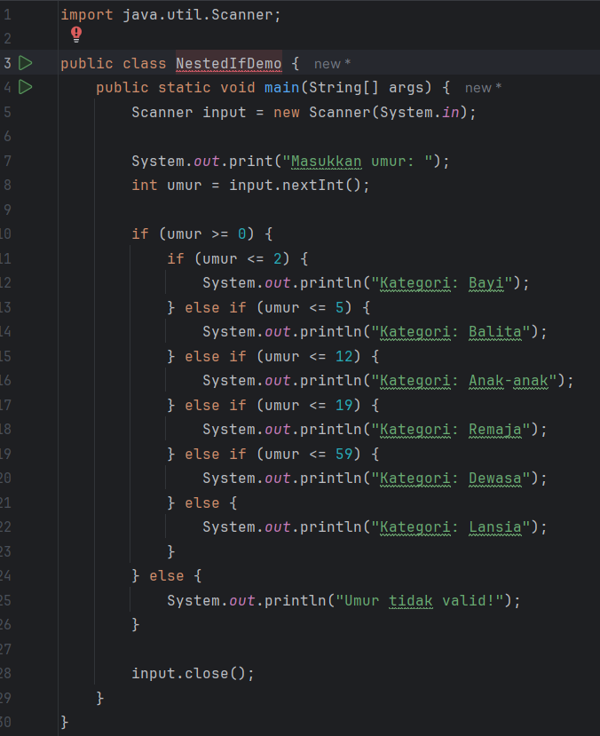
OUTPUT
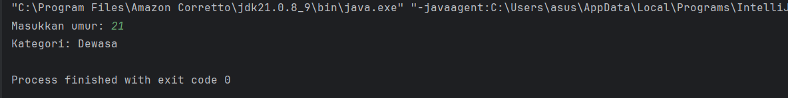

#### Analisa dan Pembahasan
1. Program GradeDemo
   Fungsi Program:

Menentukan nilai huruf (grade) dan keterangan berdasarkan nilai angka yang dimasukkan.
Analisa:
Input: nilai (0–100).
Menggunakan if-else if-else untuk menentukan grade:
>= 85 → A (Excellent)
>= 75 → B (Good)
>= 65 → C (Fair)
>= 55 → D (Poor)
< 55 → E (Fail)
Output: menampilkan nilai, grade, dan keterangan.
2. Program MenuDemo
Fungsi Program:

Menampilkan menu pilihan untuk menghitung luas bangun datar.
Analisa:
Menggunakan switch-case untuk menu:
Luas persegi → input sisi → rumus sisi * sisi.
Luas lingkaran → input jari-jari → rumus π * r².
Luas segitiga → input alas dan tinggi → rumus 0.5 * alas * tinggi.
Keluar → mencetak pesan terima kasih.
Jika input salah → tampil pesan "Pilihan tidak valid!".
3. Program NestedIfDemo
Fungsi Program:
Menentukan kategori umur berdasarkan input yang dimasukkan.
Analisa:
Input: umur (integer).
Menggunakan nested if (if di dalam if).
Kategori umur:
< 2 → Bayi
<= 5 → Balita
<= 12 → Anak-anak
<= 19 → Remaja
<= 59 → Dewasa
>= 60 → Lansia

Jika umur negatif → "Umur tidak valid!".

### Praktikum 4 - Struktur Kontrol: Perulangan
#### Dasar Teori
- `for` digunakan jika jumlah perulangan sudah diketahui.
- `while` digunakan jika perulangan bergantung pada kondisi.
- `do-while` memastikan blok program dijalankan minimal satu kali.
- Nested loop digunakan untuk perulangan bersarang.

#### Langkah Praktikum
1. Buat file `ForLoopDemo.java` untuk contoh for loop.
2. Buat file `WhileLoopDemo.java` untuk contoh while dan do-while.
3. Buat file `NestedLoopDemo.java` untuk contoh nested loop.

#### Screenshoot Hasil
ForLoopDemo.java
CODE
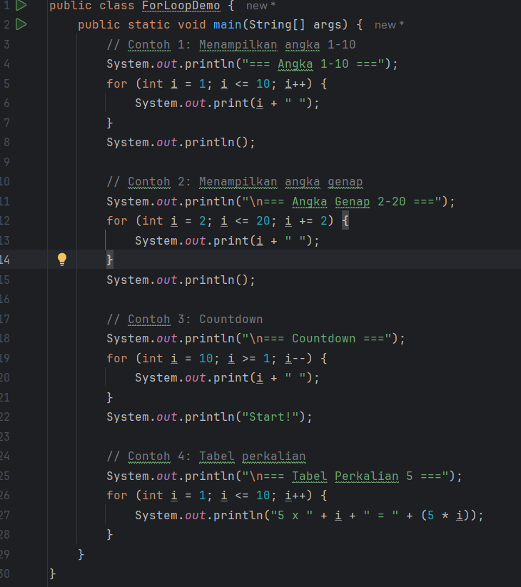
OUTPUT
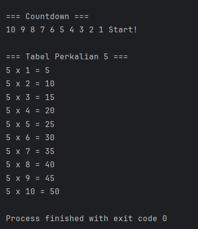
WhileLoopDemo.java
CODE
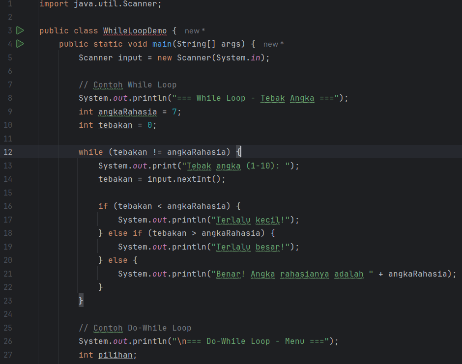
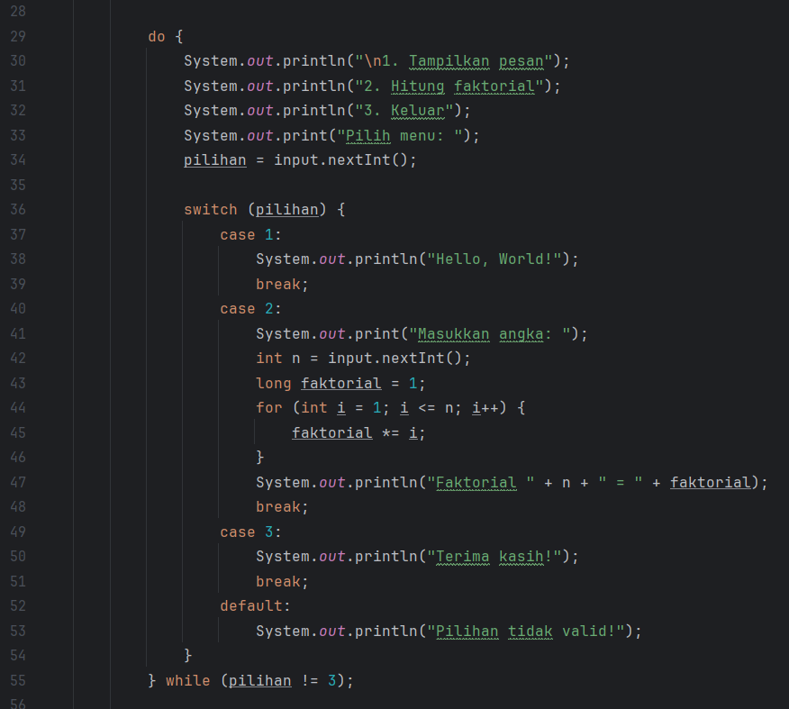
NestedLoopDemo.java
CODE
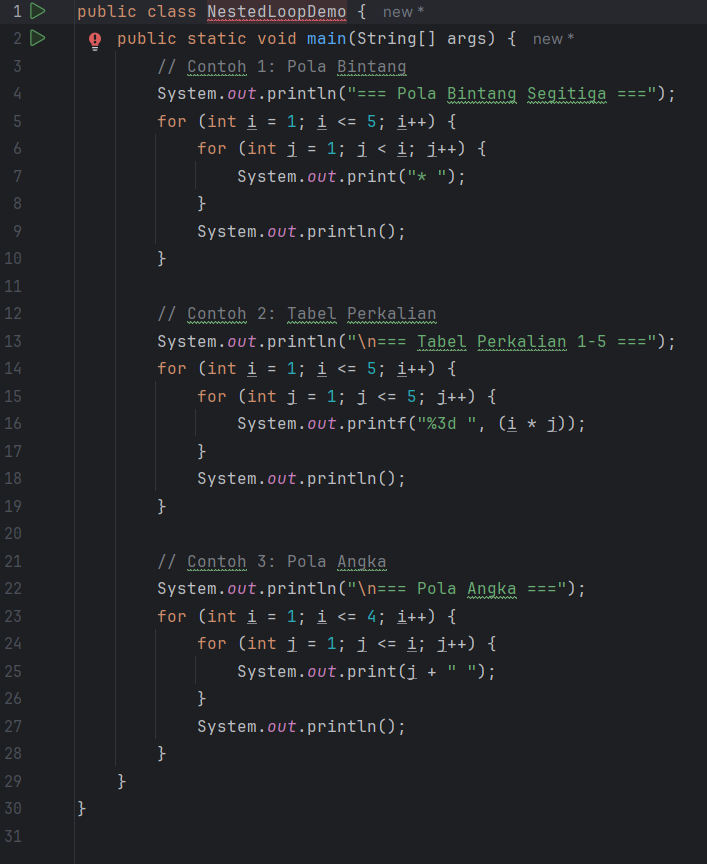
OUTPUT
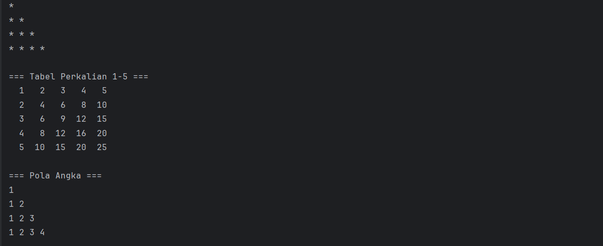

#### Analisa dan Pembahasan
1. Program ForLoopDemo
   Fungsi Program:

Program ini mendemonstrasikan penggunaan perulangan for dengan beberapa variasi.

Analisa:

Contoh 1: Menampilkan angka 1–10
Menggunakan loop for (int i = 1; i <= 10; i++)
Output: 1 2 3 4 5 6 7 8 9 10
Contoh 2: Menampilkan angka genap 2–20
Loop dengan langkah i += 2
Output: 2 4 6 8 10 12 14 16 18 20
Contoh 3: Countdown
Loop mundur for (int i = 10; i >= 1; i--)
Output: 10 9 8 7 6 5 4 3 2 1
Lalu mencetak "Start!"
Contoh 4: Tabel perkalian 5
Menampilkan hasil perkalian 5 dari 1 sampai 10

Program WhileLoopDemo
Fungsi Program:

Menunjukkan contoh penggunaan while loop dan do-while loop.

Analisa:

2. While Loop 

Program meminta input user untuk menebak angka rahasia (7).
Loop while akan terus berjalan sampai tebakan benar.
Jika tebakan < 7 → "Terlalu kecil!"
Jika tebakan > 7 → "Terlalu besar!"
Jika benar → "Benar! Angka rahasianya adalah 7".
Do-While Loop (Menu)
Menampilkan menu interaktif:
Tampilkan pesan "Hello, World!"
Hitung faktorial dari sebuah angka
Keluar
Loop do-while memastikan menu selalu tampil minimal sekali, dan berhenti jika user memilih 3.

3. Program NestedLoopDemo
   Fungsi Program:

Menunjukkan penggunaan nested loop (perulangan bersarang) untuk pola.

Analisa:

Contoh 1: Pola Bintang

Menggunakan loop bersarang untuk mencetak segitiga bintang.

## 3. Kesimpulan
Dari praktikum ini dapat disimpulkan bahwa pemahaman dasar pemrograman Java mencakup:
1. Variabel dan tipe data digunakan untuk menyimpan dan mengelola data.
2. Scanner digunakan untuk menerima input dari pengguna.
3. Struktur kontrol percabangan (`if`, `switch`) memungkinkan pengambilan keputusan dalam program.
4. Struktur perulangan (`for`, `while`, `do-while`) memungkinkan eksekusi kode berulang secara efisien.  
   Dengan memahami konsep-konsep ini, mahasiswa dapat membangun pondasi logika pemrograman yang kuat sebelum melanjutkan ke topik Java yang lebih kompleks.

---

## 5. Referensi
1. Oracle. Java Documentation — https://docs.oracle.com/javase/tutorial
2. Wahana Komputer. *Pemrograman Java untuk Pemula*. Andi Publisher.

---

